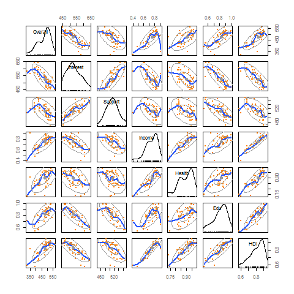

# <a name='application'>Application Using R</a>


## <a name='initialExam'>Initial Examination</a>
<span class="newthought">The data set has been constructed</span> using average Science scores by country from the Programme for International Student Assessment ([PISA](http://www.pisa.oecd.org/)) 2006, along with GNI per capita (Purchasing Power Parity, 2005 dollars), Educational Index, Health Index, and Human Development Index from [UN data](http://hdrstats.undp.org/en/tables/default.html).  The key variables are as follows (variable abbreviations in bold):

- **Overall** Science Score (average score for 15 year olds)<span class="marginnote">The education component is measured by mean of years of schooling for adults aged 25 years and expected years of schooling for children of school entering age, the health index by life expectancy at birth, and the wealth component is based on the gross national income per capita. The HDI sets a minimum and a maximum for each dimension, and values indicate where each country stands in relation to these endpoints, expressed as a value between 0 and 1. More information on the HDI measures can be found [here](http://hdr.undp.org/en/statistics/hdi/).</span>
- **Interest** in science
- **Support** for scientific inquiry
- **Income** Index
- **Health** Index
- **Edu**cation Index
- **H**uman **D**evelopment **I**ndex (composed of the Income index, Health Index, and Education Index)


But even before we get too far, it would be good to know our options in the world of GAMs. Near the end of this document is a list of some packages to be aware of, and there is quite a bit of GAM functionality available within R, even for just plotting\sidenote{\textcolor{blue}{\emph{ggplot2}} has basic gam functionality for scatterplot smoothing.  Examples are further in the text.}.  For our purposes we will use <span class="pack">mgcv</span>. 

The first thing to do is get the data in and do some initial inspections.


```{r initial_inspection_of_pisa, echo=1:3, eval=1:3}
d = read.csv('data/pisasci2006.csv')
library(psych)
describe(d)[-1,1:9]  #univariate
library(car)
png(file='vis/scattermatrix.png', bg='transparent')
scatterplotMatrix(d[,-c(1,3:5)],pch=19,cex=.5,reg.line=F, lwd.smooth=1.25,
                  spread=F,ellipse=T, col=c('gray60','#2957FF','#FF8000'),
                  col.axis='gray50', cex.labels=1, border='blue')
dev.off()
# library(GGally)
# ggpairs(d[,-c(1,3:5)], lower=list(continuous=wrap('smooth',  alpha=.2, color='ff5503')), upper='blank', axisLabels="internal") + lazerhawk::theme_trueMinimal()
```




\marginnote{
\phantomsection  % otherwise reference link will go to beginning of section instead of where this label is
\label{fig:countryscatter}
  \begin{flushleft}
    \includegraphics[scale=.25, keepaspectratio=true]{figures/interestsupportgdp}\\ Zoom in to see country names.  
  \end{flushleft}
}


The scatterplot matrix has quite a bit of information to spend some time with- univariate and bivariate density, as well as loess curves.  For our purposes we will ignore the issue regarding the haves vs. have-nots on the science scale and save that for another day. Note the surprising negative correlation between interest and overall score for science, which might remind us of \href{http://en.wikipedia.org/wiki/Simpson_paradox}{Simpson's paradox}, namely, that what occurs for the individual may not be the same for the group. One will also note that while there is a positive correlation between Income and Overall science scores, it flattens out after an initial rise. Linear fits might be difficult to swallow for human development subscales in general, but let's take a closer look\sidenote{In the following plots I have a ggplot object called \emph{ggtheme} to clean up the default plotting scheme.  See the \hyperref[code:ggtheme]{appendix}.}.


<<ggplot1, size='footnotesize', message=FALSE, eval=FALSE, tidy=FALSE>>=
library(ggplot2); library(reshape2)
#get data into a form to take advantage of ggplot
dmelt = melt(d, id=c('Country','Overall'), 
             measure=c('Interest','Support','Income','Health','Edu','HDI'))

#leave the smooth off for now
ggplot(aes(x=value,y=Overall), data=dmelt) +
  geom_point(color='#FF8000',alpha=.75) +
  #geom_smooth(se=F) +
  geom_text(aes(label=Country), alpha=.25, size=1,angle=30, hjust=-.2,
            vjust=-.2) +
  facet_wrap(~variable, scales='free_x') +
  ggtheme
@

\medskip{}

We can see again that linear fits aren't going to do so well for some, though it might be a close approximation for interest in science and support for science.  Now let's run the smooth.  By default \textcolor{blue}{\emph{ggplot2}} will use a loess smoother for small data sets (i.e. < 1000 observations), but can use the \textcolor{blue}{\emph{mgcv}} \textcolor{red}{\texttt{gam}} function as a smoother, though you'll need to load either the \textcolor{blue}{\emph{gam}} or \textcolor{blue}{\emph{mgcv}} packages first.

\marginnote{
\begin{flushleft}
  \includegraphics[scale=.25, keepaspectratio=true]{figures/interestsupportgdp2}
\end{flushleft}
}

<<ggplot2, size='footnotesize', message=FALSE, eval=FALSE, tidy=FALSE>>=
library(mgcv)
ggplot(aes(x=value,y=Overall), data=dmelt) +
  geom_point(color='#FF8000',alpha=.75) +
  geom_smooth(se=F, method='gam', formula=y~s(x), color='#2957FF') +
  facet_wrap(~variable, scales='free_x') +
  ggtheme
@

Often in these situations people will perform some standard transformation, such as a log, but it doesn't help as nearly as often as it is used.  For example, in this case one can log the overall score, Income, or both and a linear relation will still not be seen.

\section{Single Predictor}
\subsection{\small{Linear Fit}}
We will start with the simple situation of a single predictor. Let's begin by using a typical linear regression to predict science scores by the Income index.  We could use the standard R \textcolor{red}{\texttt{lm}} function, but I'll leave that as an exercise for comparison.  We can still do straightforward linear models with the \textcolor{red}{\texttt{gam}} function, and again it is important to note that the standard linear model can be seen as a special case of a GAM.


<<mod_lm, size='footnotesize', message=FALSE, cache=T>>=
library(mgcv)
mod_lm <- gam(Overall ~ Income, data=d)
summary(mod_lm)
@

What are we getting here?  The same thing you get from a regular linear model, because you just ran one.  However there are a couple things to look at.  The coefficient is statistically significant, but serves as a reminder that it usually a good idea to scale predictor variables so that the effect is more meaningful.  Here, moving one unit on Income is akin from going broke to being the richest country.  But in a more meaningful sense, if we moved from say, .7 to .8, we'd expect an increase of about 35 points on the science score.  We also see the deviance explained, which serves as a generalization of R-squared
\sidenote{For those more familiar with generalized linear models, this is calculated as (Dev$_{Null}$-Dev$_{Residual}$)/Dev$_{Null}$\\
\noindent One can verify this by running the same model via the \textcolor{red}{\texttt{glm}}, and using the values from the summary of the model object.}
, and in this case, it actually is equivalent to R-squared.  Likewise there is the familiar adjusted version of it to account for small sample size and model complexity.  The scale estimate is the scaled deviance, which here is equivalent to the residual sums of squares.  The GCV score we will save for when we run a GAM.

\subsection{\small{GAM}}
Let's now try some nonlinear approaches, keeping in mind that \\\noindent$\mu=f(x)$.  As a point of comparison, we can start by trying a standard polynomial regression, and it might do well enough\sidenote{The following example is pretty much straight from \citet[Chapter 3]{wood_generalized_2006} with little modification.}.  To start we must consider a basis for use, i.e. a set of basis functions $b_j$ that will be combined to produce $f(x)$:
\marginnote{\begin{flushleft}
  \includegraphics[scale=.25]{figures/polysplinecreation}
\end{flushleft}
}

\noindent$f(x)=\displaystyle\sum\limits_{j=1}^q b_{j}(x)\beta_{j}$
\\ \medskip{}

To better explain by example, if we had a cubic polynomial the basis is: $b_1(x) = 1$, $b_2(x)=x$, $b_3(x)=x^2$, $b_4(x)=x^3$, which, when combined give us our $f(x)$.  For those familiar with the mechanics of linear modeling, this is just our 'model matrix', which we can save out with many model functions in R via the argument \texttt{x=T} or using the \textcolor{red}{\texttt{model.matrix}} function.  With the graph at the right we can see the effects in action.  It is based on the results extracted from running the model\sidenote{see ?\textcolor{red}{\texttt{poly}} for how to fit a polynomial in R.} and obtaining the coefficients (e.g. the first plot represents the intercept of 470.44, the second plot, our $b_2$ coefficient of 289.5 multiplied by Income and so forth).  The bottom plot shows the final fit $f(x)$, i.e. the linear combination of the basis functions.

At this point we have done nothing we couldn't do in our regular regression approach, but the take home message is that as we move to GAMs we are going about things in much the same fashion; we are simply changing the nature of the basis, and have a great deal more flexibility in choosing the form.

In the next figure I show the fit using a 'by-hand' cubic spline basis \citep[see the appendix and][p.126-7]{wood_generalized_2006}.  
\marginnote{\begin{flushleft}
  \includegraphics[scale=.35]{figures/cubicbyhandggplotinset}
\end{flushleft}
}
A cubic spline is essentially a connection of multiple cubic polynomial regressions.  We choose points of the variable at which to create sections, and these points are referred to as \emph{knots}.  
Separate cubic polynomials are fit at each section, and then joined at the knots to create a continuous curve.  The graph represents a cubic spline with 8 knots\sidenote{Ten including the endpoints.} between the first and third quartiles. The inset graph uses the GAM functionality within ggplot2's \textcolor{red}{\texttt{geom\_smooth}} as a point of comparison.

Let's now fit an actual generalized additive model using the same cubic spline as our smoothing function. We again use the \textcolor{red}{\texttt{gam}} function as before for basic model fitting, but now we are using a function \textcolor{red}{\texttt{s}} within the formula to denote the smooth terms.  Within that function we also specify the type of smooth, though a default is available.  I chose 'cr', denoting cubic regression splines, to keep consistent with our previous example.


<<mod_gam1, size='footnotesize', message=FALSE, warning=FALSE, cache=TRUE>>=
mod_gam1 <- gam(Overall ~ s(Income, bs="cr"), data=d)
summary(mod_gam1)
@


The first thing to note is, that aside from the smooth part, our model code is similar to what we're used to with core R functions such as lm and glm.  In the summary, we first see the distribution assumed as well as the link function used, in this case normal and identity, respectively, which to iterate, had we had no smoothing would result in a standard regression model.  After that we see that the output is separated into \emph{parametric} and \emph{smooth}, or nonparametric parts.  In this case, the only parametric component is the intercept, but it's good to remember that you are not bound to smooth every effect of interest, and indeed, as we will discuss in more detail later, part of the process may involve refitting the model with terms that were found to be linear for the most part anyway.  The smooth component of our model regarding a country's income's relationship with overall science score is statistically significant, but there are a couple of things in the model summary that would be unfamiliar.  

We'll start with the \emph{effective degrees of freedom}, or \emph{edf}.  In typical OLS regression the model degrees of freedom is equivalent to the number of predictors/terms in the model. This is not so straightforward with a GAM due to the smoothing process and the penalized regression estimation procedure, something that will be discussed more later\sidenote{In this example there are actually 9 terms associated with this smooth, but they are each 'penalized' to some extent and thus the edf does not equal 9.}. In this situation, we are still trying to minimize the residual sums of squares, but also have a built in penalty for 'wiggliness' of the fit, where in general we try to strike a balance between an undersmoothed fit and an oversmoothed fit. The default p-value for the test is based on the effective degrees of freedom and the rank $r$ of the covariance matrix for the coefficients for a particular smooth, so here \emph{conceptually} it is the p-value associated with the $F(r, n-edf)$.  However there are still other issues to be concerned about, and ?summary.gam will provide your first step down that particular rabbit hole. For hypothesis testing an alternate edf is actually used, which is the other one provided there in the summary result\sidenote{Here it is noted 'Rel.df' but if, for example, the argument $p.type = 5$ is used, it will be labeled 'Est.Rank'. Also, there are \emph{four} p-value types one can choose from.  The full story of edf, p-values and related is scattered throughout Wood's text. See also ?\texttt{\textcolor{red}{anova.gam}}}.  At this point you might be thinking these p-values are a bit fuzzy, and you'd be right. The gist is, they aren't to be used for harsh cutoffs, say, at an arbitrary .05 level\sidenote{But then, standard p-values shouldn't be used that way either.}, but if they are pretty low you can feel comfortable claiming statistical significance, which of course is the end all, be all, of the scientific endeavor.
%pf(fval5,mod_gam1$smooth[[1]]$df,mod_gam1$df.res,lower=F) where fval5 comes from summary(mod, p.type=5); tested with interest as the predictor   pf(14.75, 9, 46.1, lower=F)

The GCV, or \emph{generalized cross validation} score can be taken as an estimate of the \emph{mean square prediction error} based on a leave-one-out cross validation estimation process.  We estimate the model for all observations except $i$, then note the squared residual predicting observation $i$ from the model.  Then we do this for all observations. However, the GCV score is an efficient measure of this concept that doesn't actually require fitting all those models and overcomes other issues\marginnote{In this initial model the GCV can be found as:\\\noindent$GCV = \frac{n*scaled\, est.}{(n-edf-{[n\,of\, parametric\, terms]})^{2}}$}.  It is this score that is minimized when determining the specific nature of the smooth.  On its own it doesn't tell us much, but we can use it similar to AIC as a comparative measure to choose among different models, with lower being better.  

\subsection{\small{Graphical Display}}
\marginnote{\begin{flushleft}
  \includegraphics[scale=.25]{figures/mod_gam1}\\ The intervals are Bayesian credible intervals.
\end{flushleft}
} One can get  sense of the form of the fit by simply plotting the model object as follows:

<<plot_mod_gam1, size='footnotesize', eval=FALSE>>=
plot(mod_gam1)
@

Although in this single predictor case one can also revisit the previous graph, where the inset was constructed directly from ggplot.  You can examine the code in the \hyperref[code:mod_gam1plot]{appendix}.


\subsection{\small{Model Comparison}}
Let us now compare our regular regression fit to the GAM model fit. The following shows how one can extract various measures of performance and the subsequent table shows them gathered together. 


<<mod_lm_fit, size='footnotesize', message=FALSE, cache=T>>=
AIC(mod_lm)
summary(mod_lm)$sp.criterion
summary(mod_lm)$r.sq  #adjusted R squared
@

Do the same to extract those same elements from the GAM. The following display\sidenote{I just gathered the values into a data.frame object and used \textcolor{red}{\texttt{xtable}} from the eponymous package to produce the table.} makes for easy comparison.

\begin{table}[ht]
\begin{flushleft}
\begin{tabular}{rrrrrrr}
  
aic\_lm & aic\_gam1 & gcv\_lm & gcv\_gam1 & rsq\_lm & rsq\_gam1 \\ 
  
550.24 & 529.81 & 1504.50 & 1053.73 & 0.52 & 0.70 \\ 
   
\end{tabular}
\end{flushleft}
\end{table}
\noindent
Comparing these various measures, it's safe to conclude that the GAM fits better.  We can also perform the familiar statistical test via the \textcolor{red}{\texttt{anova}} function we apply to other R model objects. As with the previous p-value issue, we can't be too particular, and technically one could have a model with more terms but lower \emph{edf}, where it just wouldn't even make sense\sidenote{?\textcolor{red}{\texttt{anova.gam}} for more information.}.  As it would be best to be conservative, we'll proceed cautiously.


<<mod_lm_mod_gam1_anova, size='footnotesize', message=FALSE, cache=TRUE>>=
anova(mod_lm, mod_gam1, test="Chisq")
@

It would appear the anova results tell us what we have probably come to believe already, that incorporating nonlinear effects has improved the model considerably.

%%%%%%%%%%%%%%%%%%%%%%%%%%%%%%%%%%%%%%
\section{Multiple Predictors}
Let's now see what we can do with a more realistic case where we have added model complexity.  

\subsection{\small{Linear Fit}}
We'll start with the typical linear model approach again, this time adding the Health and Education indices.

<<mod_lm2, size='footnotesize', message=FALSE, cache=TRUE>>=
mod_lm2 <- gam(Overall ~ Income + Edu + Health, data=d)
summary(mod_lm2)
@

It appears we have statistical effects for Income and Education, but not for Health, and the adjusted R-squared suggests a notable amount of the variance is accounted for\sidenote{Note that a difference in sample sizes do not make this directly comparable to the first model.}.  Let's see about nonlinear effects.

\subsection{\small{GAM}}
As far as the generalized additive model goes, we can approach things in a similar manner as before.  We will ignore the results of the linear model for now and look for nonlinear effects for each covariate.

\marginnote{The default smoother for s() is the argument bs='tp', a thin plate regression spline.}
<<mod_gam2, size='footnotesize', message=FALSE, warning=FALSE, cache=TRUE>>=
mod_gam2 <- gam(Overall ~ s(Income) + s(Edu) + s(Health), data=d)
summary(mod_gam2)
@

There are again a couple things to take note of.  First, statistically speaking, we come to the same conclusion as the linear model regarding the individual effects. One should take particular note of the effect of Health index.  The effective degrees of freedom with value 1 suggests that it has essentially been reduced to a simple linear effect.  The following will update the model to explicitly model the effect as such, but as one can see, the results are identical.


<<mod_gam2_update, size='footnotesize', message=FALSE, warning=FALSE, cache=TRUE>>=
mod_gam2B = update(mod_gam2, .~.-s(Health) + Health)
summary(mod_gam2B)
@

We can also note that this model accounts for much of the variance in Overall science scores, with an adjusted R-squared of .86.  In short, it looks like the living standards and educational resources of a country are associated with overall science scores, even if we don't really need the Health index in the model.


\subsection{\small{Graphical Display}}
Now we examine the effects of interest visually. In the following code, aside from the basic plot we have changed the default options to put all the plots on one page, added the partial residuals\sidenote{See e.g. John Fox's texts and chapters regarding regression diagnostics, and his \textcolor{red}{crplots} function in the \textcolor{blue}{\emph{car}} package.}, and changed the symbol and its respective size, among other options.

<<mod_gam2_plot, size='footnotesize', tidy=FALSE, message=FALSE, eval=FALSE, cache=TRUE>>=
plot(mod_gam2, pages=1, residuals=T, pch=19, cex=0.25, 
     scheme=1, col='#FF8000', shade=T,shade.col='gray90')
@

\marginnote{
\begin{flushleft}
  \includegraphics[scale=.25]{figures/multiple_predictors_effects}
\end{flushleft}
}
Here we can see the effects of interest, and again one might again note the penalized-to-linear effect of Health.  We again see the tapering off of Income's effect at its highest level, and in addition, a kind of sweet spot for a positive effect of Education in the mid-range values, with a slight positive effect overall.  Health, as noted, has been reduced to a linear, surprisingly negative effect, but again this is non-significant.  One will also note the y-axis scale.  The scale is on that of the linear predictor, but due to identifiability constraints, the smooths must sum to zero, and thus are presented in a mean-centered fashion.  

Previously, we had only one predictor and so we could let ggplot do the work to produce a plot on the response scale, although we could have added the intercept back in.
\marginnote{
\begin{flushleft}
  \includegraphics[scale=.40]{figures/income_on_response}
\end{flushleft}
}
Here we'll need to do a little more. The following will produce a plot for Income on the scale of the response, with the other predictors held at their mean. Seen at right.  


<<plot_mod_gam2_response, size='footnotesize', message=FALSE, eval=FALSE, tidy=FALSE, cache=TRUE>>=
# Note that mod_gam2$model is the data that was used in the modeling process, 
# so it will have NAs removed.
testdata = data.frame(Income=seq(.4,1, length=100), 
                      Edu=mean(mod_gam2$model$Edu), 
                      Health=mean(mod_gam2$model$Health))
fits = predict(mod_gam2, newdata=testdata, type='response', se=T)
predicts = data.frame(testdata, fits)

ggplot(aes(x=Income,y=fit), data=predicts) + 
  geom_smooth(aes(ymin = fit - 1.96*se.fit, ymax=fit + 1.96*se.fit),
              fill='gray80', size=1,stat='identity') +
  ggtheme
@


This gives us a sense for one predictor, but let's take a gander at Income and Education at the same time.  Previously, while using the function \texttt{\textcolor{red}{plot}}, it actually is \texttt{\textcolor{red}{plot.gam}}, or the basic plot function for a GAM class object.
There is another plotting function, \texttt{\textcolor{red}{vis.gam}}, that will give us a bit more to play with.  The following will produce a contour plot (directly to the right) with Income on the x axis, Education on the y, with values on the response scale given by the contours, with lighter color indicating higher values.  
\marginnote{
\begin{flushleft}
  \includegraphics[scale=.25]{figures/gam2_contour_IncomeEdu}
\end{flushleft} 
}

<<contour, size='footnotesize', cache=TRUE, message=FALSE, eval=FALSE>>=
vis.gam(mod_gam2, type='response', plot.type='contour')
@

First and foremost the figure to the right reflects the individual plots (e.g. one can see the decrease in scores at the highest income levels), and we can see that middling on Education and high on Income generally produces the highest scores.  Conversely, being low on both the Education and Income indices are associated with poor Overall science scores. However, while interesting, these respective smooths were created separately of one another, and there is another way we might examine how these two effects work together in predicting the response.  
\bigskip{}
\marginnote{
\begin{flushleft}
  \includegraphics[scale=.25]{figures/gam3_contour_IncomeEdu}
\end{flushleft} }

Let's take a look at another approach, continuing the focus on visual display. It may not be obvious at all, but one can utilize smooths of more than one variable, in effect, a smooth of the smooths of the variables that go into it.  Let's create a new model to play around with this feature. After fitting the model, an example of the plot code is given producing the middle figure, but I also provide a different perspective as well as contour plot for comparison  with the graph based on separate smooths.

\marginnote{
\begin{flushleft}
  \includegraphics[scale=.25]{figures/2dgam_phi30_theta_30}
\end{flushleft} }
\marginnote{
\begin{flushleft}
  \includegraphics[scale=.25]{figures/2dgam_phi30_theta_180}
\end{flushleft} 
}
<<mod_gam3, size='footnotesize', message=FALSE, warning=FALSE, cache=TRUE>>=
mod_gam3 <- gam(Overall ~ te(Income,Edu), data=d)
summary(mod_gam3)
@

<<mod_gam3_plot, size='footnotesize', message=FALSE, eval=FALSE, tidy=FALSE, cache=TRUE>>=
vis.gam(mod_gam3, type='response', plot.type='persp', 
        phi=30, theta=30,n.grid=500, border=NA)
@


In the above we are using a type of smooth called a tensor product smooth, and by smoothing the marginal smooths of Income and Education, we see a bit clearer story.  As we might suspect, wealthy countries with more of an apparent educational infrastructure are going to score higher on the Overall science score.  However, wealth is not necessarily indicative of higher science scores (note the dark bottom right corner on the contour plot)\sidenote{This is likely due to Qatar.  Refer again to the figure on page \pageref{fig:countryscatter}.}, though without at least moderate wealth hopes are fairly dim for a decent score.

One can also, for example, examine interactions between a smooth and a linear term $f(x)z$, and in a similar vein of thought look at smooths at different levels of a grouping factor. We'll leave that for some other time.

\subsection{\small{Model Comparison}}
As before, we can examine indices such as GCV or perhaps adjusted R-square, which both suggest our GAM performs considerably better. Statistically we can compare the two models with the anova function as before.  

<<mod_lm2_mod_gam2_anova, size='footnotesize', message=FALSE, cache=TRUE>>=
anova(mod_lm2, mod_gam2, test="Chisq")
@

Not that we couldn't have assumed as such already, but now we have additional statistical evidence to suggest that incorporating nonlinear effects improves the model.
