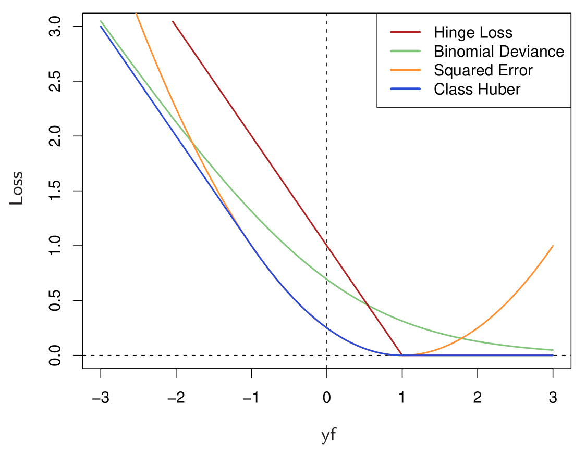

```{r setup, include=FALSE}
knitr::opts_chunk$set(message=F, fig.align='center', cache = FALSE, comment='', warning=F, R.options=list(width=120))
library(ggplot2); library(dplyr); library(lazerhawk); library(tidyr)
```

# Preface

This work will be added to, corrected, etc. but has enough content for now to make available.


# Introduction

This document attempts to provide clarification for the uninitiated.  Many in applied disciplines are exposed to standard linear regression and little more.  Or they might have a cursory glance at logistic regression, where it is presented in a manner such that one may come away feeling it is a wholly different type of analysis, even though some versions are a generalized linear model just as standard regression is.  Furthermore, there is a bit of a nomenclature issue, that again might make some think they are dealing with wholly different models, when in fact they are dealing with extensions of simpler ones they've been exposed to. This document hopes to provide a bit of clarity in this realm.

# Two categories

## Data

The most common use of logistic regression is the case where the target variable we wish to understand is a binary variable, e.g. yes/no, buy/sell, dead/alive etc.  Aside from the standard linear model for a continuous outcome, this is probably the most common statistical modeling situation.

### Binomial Distribution

As the outcome is binary, we can potentially understand the data generating process as a <span class="emph">binomial</span> distribution. The binomial is typically one of the first probability distributions introduced in a statistics class.  The classic example involves a coin flipping situation.  

Going with that, let's say we flip the coin 10 times. The chance it comes up heads or tails is 50/50, i.e. the probability = .5. If we do this once, who knows how many times heads will come up.

```{r binom1trial}
sample(c('heads','tails'), 10, prob=c(.5, .5), replace=T)
```


However, if we repeat it over and over, we can see how often we might expect each possible outcome of 10 coin flips. The binomial has a parameter $\pi$, the probability that the event in question occurs. We set the size, or number of 'trials', accordingly.

```{r binom, echo=1}
output = rbinom(5000, size=10, prob=.5)

ggplot(aes(x=factor(output)), data=data.frame(output=output)) + geom_bar(fill='lightblue', width=.7)  + xlab('') + theme_trueMinimal()
```

Since the probability is .5, we would expect an outcome of 5 heads out of 10 more than other outcomes.

Now what if we have a situation where there is only one coin flip? In this case the size or number of trials is 1, and the distribution would look like the following.

```{r binom_size1, echo=1}
output = rbinom(1000, size=1, prob=.5)

ggplot(aes(x=factor(output, labels=c('heads','tails'))), data=data.frame(output=output)) + geom_bar(fill='lightblue', width=.6)  + xlab('') + theme_trueMinimal()
```

Now we have come to the most common form of logistic regression. The target variable we wish to understand is binary, and the number of times in which it is observed is once, i.e. once per individual, tweet, firm, country, or whatever our data regards. 


## Logistic Regression Model

We'll start by writing up the data formally. For reference I'll start with the standard linear model for regression just to get our bearings.  We depict it as follows:

$$ \mu = b_0 + b_1*x_1 + b_2*x_2 \dots b_p*x_p $$
$$ \mu = X\beta $$
$$ y \sim \mathcal{N}(\mu, \sigma^2)$$

In the above $\mu$ is the linear predictor, the weighted combination of $p$ covariates $x$, written two ways, one explicit and one using matrix notation, where $X$ is the model matrix and $\beta$ the vector of coefficients.  The former is for those who are not familiar with matrix notation, as the latter can just be considered shorthand[^subscript].  The coefficients we wish to estimate are $\beta$, and for the normal distribution we also need to estimate the variance $\sigma^2$. 

For binary target variables we do not assume the data generating process is a normal distribution, but instead we often consider a binomial as above.  The Bernoulli distribution is a special case of the binomial for the situation where size=1, and might be more optimal to use for some modeling approaches (e.g. Stan).  With logistic regression, the linear predictor is the <span class="emph">logit</span>, or log of the probability of the specific label of interest over the 1 minus that probability. Note that which label we refer to is arbitrary, e.g. whether you want the probability to regard a 'yes' outcome or 'no' is entirely up to you. 

The logit is the name for the (natural) log of the odds, $\pi/(1-\pi)$, i.e. the ratio of the probability of the event of interest, $\pi$, to the probability of its non-occurrence. It theoretically ranges from $-\infty$ to $\infty$ and is centered at zero, which is akin to a probability of .5.  The logit is assumed to be some function of the covariates.

$$\begin{align}
\textrm{Logit}&\: \vcenter{:}\mathord{=} \:\ln(\frac{\pi}{1-\pi}) \\
\textrm{Logit} &= X\beta
\end{align}$$

The transformation function, or <span class="emph">link function</span>, of interest is the <span class="emph">logistic</span> link, hence the name logistic regression. Probabilities are inherently nonlinear, e.g. the change from .05 to .10 is a doubling of the probability, while that from .50 to .55 is only a 10% increase. To engage in a linear model of the sort we use in other modeling approaches, the logistic link transforms the probability response to the logit.  Converting back to the probability scale requires the inverse logistic function, which might be depicted in different ways.

<a id="binpred"></a> 
$$\begin{align} 
\pi &= \textrm{Logit}^{-1} \\
\pi &= \frac{1}{1+e^{-XB}}, \textrm{or} \\
\pi &= \frac{e^{XB}}{1+e^{XB}}
\end{align}$$

And finally, given the probability, we can get the likelihood of the the response given that probability.

$$\begin{align} 
y &\sim \mathrm{Bin}(\pi, \mathrm{size}=1), \textrm{ or} \\
y &\sim \mathrm{Bern}(\pi)
\end{align}$$


To make this clearer, let's convert a value presumed to be on the logit scale to a probability. We'll demonstrate the logit and inverse logit as well as the alternate 'by-hand' ways it might be depicted in various sources.

```{r logittoprob}
plogis(0)                  # convert to probability
log(.5/(1-.5))             # logit
qlogis(.5)
plogis(-1)                 
plogis(1)                  # 1 minus plogis(-1)
1/(1+exp(-1))
exp(1)/(1+exp(1))
```

Such a model is often called a logit model. However, calling a model by its link function seems odd to me for several reasons: there are several link functions one might use, the logit link function is used for other models (e.g. ordinal, neural nets), just calling it logit model doesn't tell you how many categories are present, and we don't do this with other models. Case in point, a very common alternative is the <span class="emph">probit</span> link function, which uses the cumulative normal distribution[^qnorm] to convert the probability scale to the logit. Practically anything that converts the linear predictor to $(0,1)$ will technically work. However, calling it a 'link' model does not change what one thinks about the underlying response distribution in this setting.

$$ y \sim \mathrm{Bern}(\pi) \quad \scriptsize{\textrm{(a probit model, same as the logistic model)}} $$ 

An example of different link functions is shown in the next figure.  There are at times reasons to prefer one over another, e.g. considering what one thinks about the tails of the distribution, and some can be seen as special cases of others (e.g. the <span class="emph">complementary log-log</span> is a special case of <span class="emph">generalized extreme value</span>). The choice becomes more important in multinomial and ordinal models.

```{r links, echo=FALSE}
LP = rnorm(2500)
Logit = plogis(LP)
Probit = pnorm(LP)
Probit_t = extraDistr::pnst(LP, df=1)
Extreme = exp(-exp(-LP))  # Generalized EV, with shape parameter = 0 (Gumbel) = cloglog
# qplot(LP, exp(-LP)*exp(-exp(-LP)), geom='line') # density function
# Cloglog = 1-exp(-exp(LP))
dlinks = tidyr::gather(data_frame(`Linear Predictor`=LP,Logit,Probit, `T`=Probit_t, 
                                  `Extreme Value`=Extreme),  #, Cloglog
                       key=Link, value=Probability, -`Linear Predictor`)
ggplot(aes(x=`Linear Predictor`, y=Probability), data=dlinks) +
  geom_line(aes(color=Link)) +
  theme_trueMinimal()
```


## Example

We'll use the example from the [UCLA ATS website](http://www.ats.ucla.edu/stat/r/dae/logit.htm), in case one wants a bit more detail or see it with languages other than R. The hypothetical data regards graduate school admission, and we have undergraduate gpa, gre scores, and school prestige, a variable with values 1 through 4 where institutions with a rank of 1 have the highest prestige, and 4 the lowest.


```{r read_admit_data, echo=1}
admission = read.csv("data/admit.csv")
DT::datatable(admission, width=400, style='bootstrap', rownames=FALSE, options=list(pageLength=5, dom='t'))
```

In this case our binary target is whether a prospective candidate is admitted or not (1=admitted, 0 not), and we wish to predict it with the other variables.

```{r logreg}
mod = glm(admit ~ gre + gpa + rank, data=admission, family=binomial)
summary(mod)
```


## Interpretation

The effects seen are in the directions expected, i.e. higher gre and gpa and more prestige suggests more likely admittance (recall lower prestige rank score means higher prestige).


### Odds ratios

The coefficients tell us what happens on the logit scale, which is perhaps not that interpretable, except in the usual regression sense. If I move up one value on gpa, the logit increases .77.  People typically convert the coefficients to <span class="emph">odds ratios</span>, which we obtain by exponentiating the coefficients.

```{r odds_ratios}
exp(coef(mod))
```

Now if I move up one on gpa, the odds of being admitted increase by a factor of `r round(exp(coef(mod))[3], 1)`, i.e. more than double. If my prestige rank increases by one (i.e. less prestige), the odds decrease by `r 100*(1-round(exp(coef(mod))[4], 2))`%.


### Predicted probabilities

Unless you do a lot of gambling, odds ratios probably aren't all that interpretable either. One can get the estimated probabilities at key values of the covariates, which are easier to understand. The following looks at the predicted probabilities for the extremes of prestige, holding gpa and gre scores at their mean.

```{r logreg_predict}
prediction_data = data.frame(gre=mean(admission$gre), gpa=mean(admission$gpa), rank=c(1,4))
predict(mod, newdata=prediction_data)                    # logit scale
predict(mod, newdata=prediction_data, type='response')   # probability scale
```

Thus even at average gre and gpa, one has a ~50% of being admitted to graduate school if they went to a highly prestigious school versus one that is not.

To make things perfectly clear, let's do it by hand.

```{r prediction}
coefs = coef(mod)
prediction = coefs[1] + coefs[2]*mean(admission$gre)  + coefs[3]*mean(admission$gpa) + coefs[4]*c(1,4)
prediction
plogis(prediction)
```

The nonlinear nature of the model becomes clear if we visualize the relationships of covariates on the logit versus probability scales. The plot below depicts the gpa effect.

```{r plot_prediction, echo=1:4, fig.width=4}
prediction_data = data.frame(gre = mean(admission$gre),
                              gpa = rep(seq(from = 0, to = 4, length.out = 100), 4), rank = 1)

preds_logit = predict(mod, newdata = prediction_data, type="link")
preds_prob = predict(mod, newdata = prediction_data, type="response")
# 
# ggplot(aes(x=gpa, y=preds_logit), data=prediction_data) +
#   geom_line(color='#ff5503') + 
#   ylim(c(-3,3)) +
#   theme_trueMinimal()
# ggplot(aes(x=gpa, y=preds_prob), data=prediction_data) +
#   geom_line(color='#ff5503') + 
#     ylim(c(0,1)) +
#   theme_trueMinimal()

library(plotly)
y2layout = list(
  # tickfont = list(color = "red"),
  overlaying = "y",
  side = "right",
  range = c(0,1),
  dtick = 1/4,
  showgrid=F
)

y1layout = list(
  range = c(-3,3),
  dtick = 1
)
plotdata = data.frame(prediction_data, preds_logit, preds_prob) %>% arrange(gpa)
plot_ly(x=gpa, y=preds_logit, data=plotdata, yaxis='y1', name='Logit', width=800) %>% 
  add_trace(x=gpa, y=preds_prob, yaxis = "y2", name='Probability Scale') %>%
  layout(yaxis2 = y2layout, yaxis=y1layout) %>% 
  theme_plotly()
```


## Summary of Standard Logistic Regression

So there you have it.  The standard logistic regression is the simplest setting for a categorical outcome, one in which there are two possibilities, and only one of which can occur. It is a special case of multinomial, ordinal, and conditional logistic regression, and so can serve as a starting point for moving toward those models.


## Extensions
### Counts

As noted, the binomial distribution refers to situations in which an event occurs x number of times out of some number of trials/observations.  In the binary logistic regression model, the number of trials is 1, but it certainly doesn't have to be.  If it is more than 1 we can then model the proportion, and at least in R the glm function is still used with family = binomial just as before.  We just specify the target variable differently, in terms of the number of times the vs. the number of times it did not.

```{r binomialreg, eval=F}
glm(cbind(occurrences, non-occurrences) ~ x + z, data=mydata, family=binomial)
```


#### Link with Poisson

If the occurrences are rare and/or the total number of trials is unknown, then the model is equivalent to Poisson regression.  For more on this see [link]() 

### Conditional Logistic

Situations arise when there are alternative specific covariates, such that the value a covariate takes can be different for the two outcomes.  This is the first step toward *discrete choice* models (a.k.a. McFadden choice model), in which there are often more than two choices (as we will see with multinomial models), and values vary with choice.  The key idea is that we have strata or groups which contain both positive and negative target values.  However, the model is similar.

$$ \textrm{Logit} \propto X\beta $$

The odds of the event are *proportional to* the linear combination of the covariates.  This generalizes the previous logistic regression model depicted, as it can be seen as a special case. 


#### Example

The following example regards infertility after spontaneous and induced abortion. It is a matched case-control study such that we have exactly one 'case', i.e. person with infertility, per two control observations[^stratum]. We will model this with covariates that regard whether or not they previously had a spontaneous or induced abortion.

```{r condlogreg}
infert = infert %>%
  mutate(spontaneous = factor(spontaneous >0, labels=c('No','Yes')),
         induced = factor(induced>0, labels=c('No','Yes')))
# ?infert
mod_logreg = glm(case ~ spontaneous + induced, data = infert, family = binomial)
summary(mod_logreg)

library(survival)
model_condlogreg = clogit(case ~ spontaneous + induced + strata(stratum), data = infert)
summary(model_condlogreg)
```


Note that the intercept cancels out in conditional logistic regression. It could vary by group and it would still cancel (similar to so-called fixed-effects models). Also, any variable that is constant within group will similarly cancel out.  This may be better understood when the (log) likelihood is expressed as follows for the case where the strata are balanced (i.e. 1:1 matching).

$$ \mathrm{L} = (X_{y=1} - X_{y=0})\beta$$
$$ \mathcal{L} = \ln(\frac{e^L}{1+e^L})$$

As such, anything constant within a strata would simply be 0.  


You might have noticed the call in the clogit command output, where it says `coxph(...)`.  That isn't an error, the conditional logit is equivalent to the stratified cox proportional hazards model where the survival time is simply 1 if the event is observed, or censored (1+) if not.

```{r survival}
coxph(Surv(rep(1, nrow(infert)), case) ~ spontaneous + induced + strata(stratum), data=infert)
```


In the case of 1:N matching, the denominator is based on the sum of all N non-event outcomes. If X represents the covariate values for which the event occurs, and Z for those in which it does not, for each strata:


$$ \mathcal{L} = \ln(\frac{e^{X_{y=1}\beta}}{\sum_{k=1}^N e^{Z_k\beta}})$$


### Bradley-Terry Model

The Bradley-Terry model (BT henceforth) is one in which we look to model pairwise rankings. For example, if one were to choose among various brands of some product they might select between two products at a time.  In the simplest case, the BT model posits the probability product $i$ is chosen over product $j$ as:

$$\pi_{i>j} = \frac{\exp(\beta_i)}{\exp(\beta_i)+\exp(\beta_j)}$$
$$\pi_{i>j} = \frac{\exp(\beta_i-\beta_j)}{1+\exp(\beta_i-\beta_j)}$$
$$\mathrm{Logit}(\pi_{i>j})  = \log(\frac{\pi_{i>j}}{1 - \pi_{i>j}}) = \log(\frac{\pi_{i>j}}{\pi_{j>i}}) = \beta_i - \beta_j$$


Thus it turns out the BT model has a connection to the standard logistic model, though we'll have to set up the data in a specific manner for comparison. We start by creating a model matrix where each column is 1 if that item is chosen, -1 if it isn't, and zero if it is not considered. Our response in this case is simply positive values. 

```{r BTdatasetup, echo=F}
logreg = function(par, X, y){
  L = X %*% par
  -sum(dbinom(y, size=1, prob=plogis(L), log=T))
}
# create some data. -1 means loser/not chosen, 1 means chosen, 0 otherwise; 
# item 1 is most preferable
BTdat = data.frame(item1 = c(-1, rep(1,7), rep(0,4)),
                   item2 = c(rep(c(0,-1), e=4), 1,-1,-1,-1),
                   item3 = c(1,-1,-1,-1, rep(0,4), -1,1,1,1),
                   y=1)

DT::datatable(BTdat,rownames=F, style='bootstrap',  options=list(dom='t', pageLength=12), width=400)
```

```{r BTglm}
# glm output for comparison; no intercept; matrix columns are reordered for easier
# comparison; item1 is the reference group and so won't have a coefficient
glmmod = glm(y ~ -1 + ., data=BTdat[,c(2,3,1,4)], family=binomial)  
coef(glmmod)

# using logreg function in appendix;
out = optim(rep(0,3), logreg, X=as.matrix(BTdat[,-4]), y=BTdat$y, method='BFGS')
out$par                  # default chooses item 3 as reference
out$par[2:3]-out$par[1]  # now same as glm with item 1 as reference
```

Once constructed we can run the standard logistic model, and I do so with a custom function, and with the <span class="func">glm</span> function.  For identification, one of the parameters must be set to zero, which glm just simply drops out.  By default the <span class="func">optim</span> output settles on the third item as the reference (as would glm[^btaslogreg]).

For the BT model we need a different data structure, and will have a binary response where 1 represents that comparison the first comparison item was chosen. I show the first few rows here.


```{r BTdatasetup2, echo=F}
# create data format for BT2 package, y is 1 = winner
BTdat2 = rbind(data.frame(comp1= 'item1', comp2='item2', y=rep(1,4)),
               data.frame(comp1= 'item1', comp2='item3', y=c(0,1,1,1)),
               data.frame(comp1= 'item2', comp2='item3', y=c(1,0,0,0)))

BTdat2 = BTdat2 %>% 
  mutate(comp1=factor(comp1, levels=c('item1','item2','item3')),
         comp2=factor(comp2, levels=c('item1','item2','item3')))

DT::datatable(BTdat2,rownames=F, style='bootstrap',  options=list(dom='t', pageLength=6), width=300)
```

The following uses the <span class="pack">BradleyTerry2</span> package and compares the results to the standard logistic both with our custom function and the glm result.


```{r BTcomparison, echo=-7}
library(BradleyTerry2)
btmod = BTm(y, comp1, comp2, data = BTdat2)

# coefficients in the BT model are a glm binomial regression with appropriate
# coding of the model matrix, and represent the difference in the coefficient
# from the reference group coefficient.
data.frame(optim=out$par[2:3]-out$par[1], glm=coef(glmmod)[-3], BT=coef(btmod)) %>% round(5)
```


We can see that all results are the same.  Once again the output parameters from the model thus tells us the coefficient *difference* from some reference group coefficient.  Using the inverse logit transform tells us the probability of selecting that item relative to the reference group, but as noted previously, that transformation applied to any difference of the coefficients tells us that probability.  For example, with Item 1's parameter set to zero, the probability of choosing Item 1 vs. Item 2 is `plogis(0-(-2.83894))` `r round(plogis(0-(-2.83894)),3)`, which you can confirm by applying the <span class="func">fitted</span> function to the <span class="objclass">btmod</span>.  

Note also the BT model is generalizable to counts, just like binary logistic regression is a special case of binomial regression more generally.  Also, the BT model can handle ties, and choice specific covariates, but at that point we're in the realm of multinomial regression, so we'll turn to that now.


# More than two

In many situations the variables of interest have more than two categories, and as such the standard binary approach will not be the best approach[^mach]. In the simplest case, we might have the same interpretation, but as we will see things can be notably extended from that.


## Multinomial Logistic Regression


### A starting point

We'll start with another example from the [UCLA ATS website](http://www.ats.ucla.edu/stat/stata/dae/mlogit.htm) (the example there is done with Stata for those interested). 200 entering high school students make program choices: general program, vocational program and academic program. We will model their choice using their writing score as a proxy for scholastic ability and their socioeconomic status, a categorical variable of low, middle, and high values.  

```{r readLogitData, echo=3, eval=T}
# haven gets entirely too cute with what is a simple data set
# haven::write_dta(foreign::read.dta("http://www.ats.ucla.edu/stat/data/hsbdemo.dta"), 'logistic/data/hsbdemo.dta')
program = foreign::read.dta('data/hsbdemo.dta')
program$prog = relevel(program$prog, ref = "academic")
```

As there are three categories we no longer use the glm function, which does not have the multinomial as a possible value to the 'family' argument.  There are a few packages available we could use, and here I'll use the <span class="pack">mlogit</span> package[^mnlogit].  I should also mention that it has a very extensive vignette that is worth perusal, at least part of which has been incorporated into later discussion.  

Let's run the model to predict program choice. Because of the <span class="pack">mlogit's</span> modeling flexibility, the data either has to have a specific structure or be told what the structure is. This oddly means that one can apparently not use it directly for what some might consider the standard multinomial model without pre-processing, and it's not the most intuitive approach to get it into the proper format with the <span class="func">mlogit.data</span> function. The gist is that all choices must be represented for each individual, along with a binary variable that represents the actual choice made. Those familiar with mixed models, e.g. with longitudinal data, will note this as *long* format.

Original: 

```{r mlogit_data_orig, echo=FALSE}
DT::datatable(program[,1:7], options=list(dom='t', pageLength=5), style='bootstrap', rownames=F, width=600)
```

<br>
Long format:

```{r mlogit_data_proc, echo=F}
library(mlogit)

programLong = program %>% 
  select(id, prog, ses, write) %>% 
  mlogit.data(data=, shape='wide', choice='prog', id.var='id')
DT::datatable(programLong, options=list(dom='t', pageLength=5), style='bootstrap', width=600, rownames=F)
```

The program variable is now just a logical variable that notes which of the alternatives, i.e. the `alt` variable, was chosen. The reason for this data format is that it would allow for alternative specific variables to come into the model as well, something we will see later.

Keeping with our previous formulation, we can see the model as a *set* of logistic regression models for the probability of some category vs. a reference category.  Here we'll choose the reference category as academic.

$$\ln\left(\frac{\pi_{\textrm{prog=general}}}{\pi_{\textrm{prog=academic}}}\right) = b_{0\_\mathrm{gen}} + b_{1\_\mathrm{gen}}\mathrm{write} + b_{3\_\mathrm{gen}}\textrm{ses}_\textrm{middle} + b_{4\_\mathrm{gen}}\textrm{ses}_\textrm{high}$$
$$\ln\left(\frac{\pi_{\textrm{prog=vocation}}}{\pi_{\textrm{prog=academic}}}\right) = b_{0\_\mathrm{voc}} + b_{1\_\mathrm{voc}}\mathrm{write} + b_{3\_\mathrm{voc}}\textrm{ses}_\textrm{middle} + b_{4\_\mathrm{voc}}\textrm{ses}_\textrm{high}$$


So our interpretation will be as before, it's just that we'll have to interpret K-1 sets of parameters for K total categories. Let's go ahead and run the model.

```{r mlogit_model}
multi_mod = mlogit(prog ~ 1|write + ses, data=programLong)
summary(multi_mod)
```

Note that we get two sets of output. You can think of it as you would two separate binary logistic regressions, one where academic is the reference group and general the positive value, and another model that also has academic as the reference group and vocational as the positive value.  We see statistically notable effects of writing score and high ses (low ses is the reference category).  The general interpretation would similar to before, but sometimes the exponentiated values are referred to *relative risk* rather than an odds ratio. It is no longer $\pi/(1-\pi)$, but a ratio of two relative probabilities (one group vs. an arbitrary reference group), hence the name relative risk (the 'risk' comes from biostats where the event of interest is usually something like death, disease, etc.)[^rrr].

As we move up one score on the variable write, we would see a decrease of `r round(coef(multi_mod)[3],3)` in the log probability of choosing the general program relative to the academic.  In other words, higher write scores are associated with a more likely choosing of the academic program instead of the general. The same goes for the vocational group, but it is stronger, i.e. we're even more likely to select the academic program over the vocational with an increase in write score.

It is important to note that the output doesn't tell us the overall effect of write is due to the relative nature of the model.  Let's plot the predictions so that we can understand it better. In the following, ses is fixed to be 'middle'.

```{r plotmultinom, echo=FALSE}
preddata = data.frame(write=c(replicate(3, seq(min(program$write), max(program$write), length.out=90))),
                      ses=factor('middle', levels=levels(program$ses)))
preddata = data.frame(preddata, predict(multi_mod, newdata=arrange(preddata, write), returnData=T))

preddata %>%
  select(-ses) %>%
  gather(key=outcome, value=probability, -write) %>%
  arrange(write) %>%
  ggplot(aes(x=write,y=probability, color=outcome)) +
  geom_line(lwd=1) +
  scale_color_manual(values=c('lightblue', 'salmon', 'lightgreen')) +
  theme_trueMinimal()
```

So the general interpretation of the effect of write would be that higher scores increase the probability of choosing the academic program, decrease the probability of choosing the vocational program, and have little effect on choosing the general program.  Here are predictions for all three ses levels.


```{r plotmultinom2, fig.width=8, fig.height=3, echo=FALSE}
preddata = data.frame(write=c(replicate(3, seq(min(program$write), max(program$write), length.out=90))), 
                      ses=factor(rep(levels(program$ses), t=90), levels(program$ses)))
preddata = data.frame(preddata, predict(multi_mod, newdata=arrange(preddata, write), returnData=T))

preddata %>% 
  gather(key=outcome, value=probability, -write, -ses) %>% 
  ggplot(aes(x=write,y=probability, color=outcome)) +
  geom_line(lwd=1) +
  scale_color_manual(values=c('lightblue', 'salmon', 'lightgreen')) +
  facet_grid(~ses) +
  theme_trueMinimal()
```


### Utility Maximization

In general we can consider the bi/multinomial logistic model from the perspective of utility maximization, in which a person (or whatever the unit of observation is) selects the choice that will provide most utility to them[^utility]. The probability a person will choose alternative $i$, $\pi_i$, given some utility over all other alternatives $j$, can be formulated as:

$$ \pi_i = \textrm{Prob}(U_i > U_{\forall j\neq i)}$$

Note that the actual value of utility doesn't matter, just the difference.  So comparing choice $i$ vs. some specific category $j$:

$$ \pi_i = \textrm{Prob}(U_i - U_j > 0)$$


The fact that only differences matter has implications for how we estimate the model. Consider the utility for category 1 and 2 we have the typical linear combination we've seen before.  Here we'll assume X is an individual level covariate, say age. There might be other covariates as well, but we'll just focus on this one.

$$U_1 = \dots + b^1_1\mathrm{Age} + \epsilon_1$$
$$U_2 = \dots + b^1_2\mathrm{Age} + \epsilon_2$$

If we try to estimate the probability U_2 - U_1 > 0, the age variable doesn't change for the individual and thus would drop out.  However, we can set the $b^1_1$ to zero and we end up with the following:

$$\begin{align}
U_1 &= \dots + \epsilon_1 \\
U_2 &= \dots + b_2\mathrm{Age} + \epsilon_2
\end{align}$$

And $b_2$ now represents the difference $b^1_2 - b^2_2$.  The interpretation of the coefficient isn't the effect of age on the utility of choice 2, but rather on the utility of choice 2 relative to choice 1.  In addition, it turns out that if we assume an extreme value distribution for the $\epsilon$, the logistic distribution naturally arises when considering their difference. In terms of the predicted probabilities, recall our previous depiction for the [binary outcome case](#binpred).  Now the probability of selecting choice $i$ is:

$$ \frac{e^{X\beta_i}}{\Sigma^J_{j=1}e^{X\beta_j}}$$


If the first set of coefficients is zero, then it becomes:

$$ \pi_1 = \frac{1}{1 + \Sigma^J_{j=2}e^{X\beta}} \quad \tiny\textrm{(choice 1)}$$
$$ \pi_{i \neq 1} = \frac{e^{X\beta_i}}{1 + \Sigma^J_{j=2}e^{X\beta_j}}  \quad \tiny\textrm{(others)}$$


### Alternative specific covariates

Consider the following situation in which we have several possible outcomes[^mlogit] chosen by individuals.

- There are *alternative specific* variables $x_{ij}$ with constant coefficient $\beta$
- There are *individual specific* variables $z_i$ with alternative specific coefficients $\gamma_j$
- There are *alternative specific* variables $w_{ij}$ with alternative specific coefficients $\delta_j$

So the conceptual model for the *utility* for alternative $j$ (with intercepts $\alpha$) is:

$$U_{ij} = \alpha_j + \beta x_{ij} + \gamma_jz_i + \delta_jw_{ij}$$

Common names for some models pertaining to such data are:

<span class="emph">multinomial logit</span>: in this case we have only individual specific covariates

<span class="emph">conditional logit</span>: we have only alternative specific covariates

<span class="emph">mixed logit</span>: has both kinds of variables

We can see our model in terms of differences as follows.  Here we'll keep the individual subscript as it is particularly informative. So for individual $i$ and choice $j$ versus choice $k$

$$ U_{ij} - U_{ik} = (\alpha_j-\alpha_k) + \beta (x_{ij} -x_{ik}) + (\gamma_j-\gamma_k)z_i + (\delta_jw_{ij}-\delta_kw_{ik})$$

Again the $x$ and $w$ represent covariates that vary by choice, the former will have a constant effect $\beta$, while the latter will have alternative specific effects. Variables specific to the individual are $z$ and will have K-1 effects.

As an demonstration, we have the following data on travel mode choice for travel between Sydney and Melbourne, Australia to help further clarify the nature these types of variables. We have a data frame containing 840 observations on 4 modes for 210 individuals.

- individual: Factor indicating individual with levels 1 to 200.
- mode: Factor indicating travel mode with levels "car", "air", "train", or "bus".
- choice: Factor indicating choice with levels "no" and "yes".
- wait: Terminal waiting time, 0 for car.
- vcost: Vehicle cost component.
- travel: Travel time in the vehicle.
- gcost: Generalized cost measure.
- income: Household income.
- size: Party size.

It looks like the following:

```{r loadTravel, message=FALSE, echo=FALSE}
library(mlogit)
data(TravelMode, package='AER')
DT::datatable(TravelMode, width=400, style='bootstrap', rownames=FALSE, options=list(pageLength=10, dom='t'))
```

We've seen the conditional logit model previously for the two category case. Unfortunately, *conditional logit* might also refer to a type of model for longitudinal data, and *mixed logit* might be short for a mixed effects model with random effects. The point is you need to be careful and make sure the model is clear.  We'll use mlogit to model each type of covariate, and in this example we'll allow travel time to have a choice constant effect, income will be an individual specific effect, and vehicle cost will have choice specific effects.

```{r mlogit_model_altspecific}
library(mlogit)
travel_mod = mlogit(choice ~ travel | income | vcost, data=TravelMode, 
                    shape='long', alt.var='mode',  chid.var = "individual")
summary(travel_mod)
```

Air travel is the reference group in the above model.  We can see that increased travel time will decrease the probability of making any particular choice.  Increased income means one is more likely to travel by air. For The vehicle cost seems mostly to negatively impact choice of car and train.  Note that the covariates in this case represent the *difference* in vehicle cost for that mode relative to air travel. For example, as the difference in cost decreases for train relative to air travel, we'd expect the individual to less likely to select train travel.

It can be instructive to see the model matrix for the model.

```{r mlogit_modelmatrix, echo=F}
DT::datatable(as_data_frame(model.matrix(travel_mod)), width=400,
              style='bootstrap', rownames=FALSE, options=list(autowidth=FALSE, pageLength=10, dom='t'))
```

Alternative constant variables remain unchanged, while alternative specific variable get coded in a pseudo-indicator style. Individual specific covariates are in pseudo-dummy code style.  In both cases the 1 that would exist in standard coding is replaced by the actual value.


### Extensions

#### Other link functions

There is an underlying assumption to the multinomial logistic model, and it is that the comparison of two alternatives is independent of any other comparisons, otherwise known as <span class="emph">independence of irrelevant alternatives</span> (IIA). This might not be viable, and by switching to a probit link function we can get around this by modeling the correlation of utilities.  However, I appreciate Kenneth Train's position on this, which suggests that the logit model is not so much an assumption as it is an ideal.  The issues are subtle, but using the logistic approach as an approximation is viable even in situations where we might think IIA violated.  We often do the same with the normal distribution, and there is little practical consequence.

#### Nested logit

One of the more common extensions of the above includes the <span class="emph">nested logit</span> model, or hierarchical logit, in which one choice may lead to a specific subset of others. This is in fact very common in survey design in which there is branching, such that an individual may not encounter some questions unless they answer a previous one in a certain way.  As a s specific example, one might first ask if a respondent has purchased beer in the past week, then if so, whether they bought a big brew, a fake craft brew, a craft brew, or a local craft brew.  I won't provide a specific example here (yet), but it's worth knowing about it as a possible option.

#### Bivariate probit

Another extension one may come across is a <span class="emph">bivariate probit</span> model, in which one has two responses one wants to investigate simultaneously, and while acknowledging their correlation.  I've honestly not seen it outside of the binary outcome setting in econometrics or those trained in that fashion (e.g. the Stata crowd).  However out of curiosity I looked into at one time, and provide some code for maximum likelihood estimation in the [appendix](#bivprob).


# Ordered categories

In the case of ordered categories, we can still use the latent variable conceptualization as before.  A key idea to keep in mind is that we are treating the target variable as categorical, not numeric, which is often done as a convenience. I think this is mostly done simply because people are not taught ordinal regression, but the output is not much more complex than what the standard linear model would provide, and the predicted probabilities of each category might be more desirable.

The following represents the <span class="emph">ordered logistic</span> model, otherwise known as the proportional odds model.

$$U = \theta_j + X\beta$$

$$\begin{align}
y &= 1 \quad \textrm{if}\quad U \leq \theta_1 \\
y &= 2 \quad \textrm{if}\quad \theta_1 < U \leq \theta_2 \\
y &= 3 \quad \textrm{if}\quad \theta_2 < U \leq \theta_3 \\
\vdots \\
y &= K \quad \textrm{if}\quad \theta_{k-1} < U \leq \theta_k \\
\end{align}$$


The $\theta_j$ represent cutoffs, or thresholds, which when transformed represent the baseline probability for category $j$ or below.  When running a standard ordinal model such as this, one will get the regular coefficients from a logistic model along with a threshold for k-1 categories, as the last is set to $\infty$. Note that if we only had two categories, it is equivalent to the binary logistic regression model.

As an example, we can look at data regarding wine bitterness via the <span class="pack">ordinal</span> package. See `?wine` for details, but essentially we are looking at factors in the pressing process that might contribute to bitterness. These are the temperature (warm vs. cold) and contact between juice and skins (yes-no).

```{r ologit}
library(ordinal)
wine_mod = clm(rating ~ contact + temp, data=wine)
summary(wine_mod)
# lm(as.integer(rating) ~ contact + temp, data=wine) # for comparison
# lm(response ~ contact + temp, data=wine)           # for comparison via raw response scale
```

The coefficients speak to the probability of being in a higher category relative to a lower category[^backwardsorder].  Thus warmer temperatures and contact lead to a higher bitterness rating. The following shows how to get probabilities for each class.

```{r ologit_probs, echo=-8}
# get fitted probs
mm = model.matrix(wine_mod)$X[,-1]
thresh = coef(wine_mod)[1:4]
beta = coef(wine_mod)[-(1:4)]
fits = sapply(thresh, function(int) plogis(int - mm %*% beta))
probs14 = t(apply(cbind(0, fits), 1, diff)); colnames(probs14) = paste0('cat',1:4)
round(cbind(probs14, 
            cat5 = 1-rowSums(probs14), 
            ordpackfit = fitted(wine_mod), 
            rating=wine$rating), 2) %>% 
  head
detach(package:ordinal)
```

## Extensions

### Different links

As with other models discussed, we could use different link function in the approach. As with the other categorical models, a very common one is the <span class="emph">probit</span> link function, which in this case will provide similar fits.  Another common link is the <span class="emph">complementary log-log</span>[^cloglog] link, which leads to a proportional hazards interpretation a la survival analysis.

### Generalized

We noted that the standard model was a proportional odds model, in which the effects are the same whether we are talking about moving from category one to any above, or category (one or) two to any above etc.  The generalized ordinal logistic model would relax this assumption, and allow any set of coefficients to vary depending on the category.  Thus if there are $i$ $\beta$ coefficients, we could potentially have $i * K-1$ parameters plus the thresholds.

### Other models

Other models can be used based on substantive considerations.  As an example, an adjacent category approach would posit models for categories 1 vs. 2, 2 vs. 3 etc.  The continuation ratio compares previous categories to the current, e.g. 1 vs. 2, 1 and 2 vs. 3 etc. the following graphic demonstrates these models visually.

```{r visologit, echo=FALSE}
y = factor(1:9)
x = factor(1:5)

base_d = expand.grid(x, y)
base_d$value = 1
base_d$value[base_d$Var2 %in% c(2,4,6,8)] = 2
# qplot(Var1, Var2, data=base_d, geom='tile', fill=value)

d_mlogit = base_d
d_mlogit$value[2:4] = 2
d_mlogit$value[5] = 3
d_mlogit$value[c(12,13,15)] = 2
d_mlogit$value[14] = 3
d_mlogit$value[c(22,24:25)] = 2
d_mlogit$value[23] = 3
d_mlogit$value[33:35] = 2
d_mlogit$value[32] = 3


mlogit = ggplot(aes(Var1, Var2, fill=factor(value)), data=d_mlogit) +
  geom_tile(color='white') +
  labs(x='category', y='', title='Multinomial Logit') +
  scale_fill_manual(values=c('lightblue', 'white', 'salmon')) +
  lazerhawk::theme_trueMinimal() +
  theme(legend.position='none',
        axis.text.y=element_blank(),
        axis.ticks.y=element_blank(),
        panel.grid=element_line(size=2),
        plot.title=element_text(color='gray35'),
        axis.title.x=element_text(color='gray25'))

d_ologit = base_d
d_ologit$value[5] = 3
d_ologit$value[c(14:15)] = 3
d_ologit$value[c(23:25)] = 3
d_ologit$value[32:35] = 3


ologit = ggplot(aes(Var1, Var2, fill=factor(value)), data=d_ologit) +
  geom_tile(color='white') +
  labs(x='category', y='', title='Ordered Logit (proportional odds)') +
  scale_fill_manual(values=c('lightblue', 'white','salmon')) +
  lazerhawk::theme_trueMinimal() +
  theme(legend.position='none',
        axis.text.y=element_blank(),
        axis.ticks.y=element_blank(),
        panel.grid=element_line(size=2),
        plot.title=element_text(color='gray35'),
        axis.title.x=element_text(color='gray25'))

d_acat = base_d
d_acat$value[1:3] = 2
d_acat$value[5] = 3
d_acat$value[c(11,12,15)] = 2
d_acat$value[14] = 3
d_acat$value[c(21,24,25)] = 2
d_acat$value[23] = 3
d_acat$value[33:35] = 2
d_acat$value[32] = 3


acat = ggplot(aes(Var1, Var2, fill=factor(value)), data=d_acat) +
  geom_tile(color='white') +
  labs(x='category', y='', title='Ordered Logit (adjacent category)') +
  scale_fill_manual(values=c('lightblue', 'white','salmon')) +
  lazerhawk::theme_trueMinimal() +
  theme(legend.position='none',
        axis.text.y=element_blank(),
        axis.ticks.y=element_blank(),
        panel.grid=element_line(size=2),
        plot.title=element_text(color='gray35'),
        axis.title.x=element_text(color='gray25'))


d_crat = base_d
# d_crat$value[1:3] = 2
d_crat$value[5] = 3
d_crat$value[15] = 2
d_crat$value[14] = 3
d_crat$value[24:25] = 2
d_crat$value[23] = 3
d_crat$value[33:35] = 2
d_crat$value[32] = 3


crat = ggplot(aes(Var1, Var2, fill=factor(value)), data=d_crat) +
  geom_tile(color='white') +
  labs(x='category', y='', title='Ordered Logit (continuation ratio)') +
  scale_fill_manual(values=c('lightblue', 'white','salmon')) +
  lazerhawk::theme_trueMinimal() +
  theme(legend.position='none',
        axis.text.y=element_blank(),
        axis.ticks.y=element_blank(),
        panel.grid=element_line(size=2),
        plot.title=element_text(color='gray35'),
        axis.title.x=element_text(color='gray25'))

gridExtra::grid.arrange(mlogit, ologit, acat, crat)
```


# Other

## Response Distributions

### Categorical
As Bernoulli is to the binomial, so is the <span class="emph">categorical distribution</span>, commonly referred to as such in computer science, to the multinomial distribution. In other words, if only one choice among several is made (i.e. we're not dealing with counts), then we have the categorical distribution.


### Beta-binomial
The <span class="emph">beta binomial</span> distribution allows one to incorporate <span class="emph">over-dispersion</span> in the binomial model in cases where the number of trials is greater than 1.  For similar reasons one employs the <span class="emph">negative binomial</span> instead of the Poisson distribution for count data.


### Beta regression

<span class="emph">Beta regression</span> allows one to model a target variable that falls in $(0,1)$, such as probabilities/proportions or other ratios.  The <span class="emph">beta distribution</span> is highly flexible- it is symmetric if the mean is .5 and skews toward 0 or 1 as the mean drifts toward those boundaries.  This would be useful for targets that do not follow the binomial distribution, or perhaps as a more flexible alternative. Zero/One-inflated models are available as seen with count distributions.  A few useful R packages are <span class="pack">betareg</span>, <span class="pack">mgcv</span>, and <span class="pack">VGAM</span>, and for the multivariate analog of the beta, the <span class="emph">dirichlet distribution</span>[^dirich], the <span class="pack">DirichletReg</span> package.  Note that the beta distribution can serve as a prior for $\pi$ in the binomial, as the dirichlet can for the vector of probabilities in the multinomial distribution.  I have examples of such models in both standard and Bayesian form, including mixed models, [here](https://github.com/m-clark/Miscellaneous-R-Code/tree/master/ModelFitting/Bayesian).

## Performance metrics

In typical classification situations we are interested in overall accuracy[^perfmet].  However there are situations, not uncommon, in which simple accuracy isn't a good measure of performance.  As an example, consider the prediction of the occurrence of a rare disease. Guessing a non-event every time might result in 99.9% accuracy, but that isn't how we would prefer to go about assessing some classifier's performance.

To demonstrate other sources of classification information, we will use the following 2x2 table that shows values of some binary outcome (0 = non-event, 1 = event occurs) to the predictions made by some model for that response (arbitrary model).  Both a table of actual values, often called a confusion matrix[^confusion], and an abstract version are provided.

```{r confusionMatrix, echo=FALSE}
tab_number = matrix(c(41,21,16,13), ncol=2, byrow=T); colnames(tab_number) = c('Actual 1', 'Actual 0'); rownames(tab_number) = c('Predicted 1', 'Predicted 0')
tab_letter = matrix(LETTERS[1:4], ncol=2, byrow=T); colnames(tab_letter) = c('Actual 1', 'Actual 0'); rownames(tab_letter) = c('Predicted 1', 'Predicted 0')
pander::pander(tab_number)
pander::pander(tab_letter)
A = 41
B = 21
C = 16
D = 13
```

- <span class="emph">True Positive, False Positive, True Negative, False Negative</span> Above, these are A, B, D, and C respectively.
- <span class="emph">Accuracy</span> Number of correct classifications out of all predictions ((A+D)/Total). In the above example this would be (41+13)/91, about `r round(100*(A+D)/sum(tab_number))`%.
- <span class="emph">Error Rate</span> 1 - Accuracy.
- <span class="emph">Sensitivity</span> is the proportion of correctly predicted positives to all true positive events: A/(A+C).  In the above example this would be 41/57, about `r round(100*A/(A+C))`%. High sensitivity would suggest a low type II error rate (see below), or high statistical <span class="emph">power</span>. Also known as true positive rate.
- <span class="emph">Specificity</span> is the proportion of correctly predicted negatives to all true negative events: D/(B+D).  In the above example this would be 13/34, about `r round(100*D/(D+B))`%. High specificity would suggest a low type I error rate (see below). Also known as true negative rate.
- <span class="emph">Positive Predictive Value (PPV)</span> proportion of true positives of those that are predicted positives: A/A+B. In the above example this would be 41/62, about `r round(100*A/(A+B))`%.
- <span class="emph">Negative Predictive Value (NPV)</span> proportion of true negatives of those that are predicted negative: D/C+D. In the above example this would be 13/29, about `r round(100*D/(C+D))`%.
- <span class="emph">Precision</span>  See PPV.
- <span class="emph">Recall</span> See sensitivity. 
- <span class="emph">Lift</span> Ratio of positive predictions given actual positives to the proportion of positive predictions out of the total: (A/(A+C))/((A+B)/Total). In the above example this would be (41/(41+16))/((41+21)/(91)), or `r round((A/(A+C))/((A+B)/sum(tab_number)), 2)`.
- <span class="emph">F Score (F1 score)</span> Harmonic mean of precision and recall: 2\*(Precision\*Recall)/(Precision+Recall). In the above example this would be 2\*(.66\*.72)/(.66+.72), about .69.  
- <span class="emph">Type I Error Rate (false positive rate)</span> proportion of true negatives that are incorrectly predicted positive: B/B+D. In the above example this would be 21/34, about `r round(100*B/(B+D))`%.  Also known as alpha.
- <span class="emph">Type II Error Rate (false negative rate)</span> proportion of true positives that are incorrectly predicted negative: C/C+A. In the above example this would be 16/57, about `r round(100*C/(C+A))`%. Also known as beta.
- <span class="emph">False Discovery Rate</span> proportion of false positives among all positive predictions: B/A+B. In the above example this would be 21/62, about `r round(100*B/(A+B))`%.  Often used in multiple comparison testing in the context of ANOVA.
- <span class="emph">Phi coefficient</span> A measure of association: (A*D - B*C)/(sqrt((A+C)*(D+B)*(A+B)*(D+C))).  In the above example this would be `r round((A*D - B*C)/(sqrt((A+C)*(D+B)*(A+B)*(D+C))), 2)`.


## Loss functions

In the above we have assumed a standard likelihood approach, but in many applications prediction is of utmost importance, and we'd prefer alternative methods. In the following we note $f$ as the prediction, and for convenience we assume a [-1,1] response instead of a [0,1] response:

### Binomial log-likelihood

We'll start by depicting the likelihood approach in this manner.

$$L(Y, f(X)) = \sum log(1 + e^{-2yf})$$

The above is in deviance form, but is equivalent to binomial log likelihood if $y$ is on the 0-1 scale.

### Misclassification

Probably the most straightforward loss function is misclassification, or 0-1 loss.

$$L(Y, f(X)) = \sum I(y\neq sign(f))$$

In the above, $I$ is the indicator function and so we are merely summing misclassifications.


### Exponential

Exponential loss is yet another loss function at our disposal.

$$L(Y, f(X)) = \sum e^{-yf}$$

### Hinge Loss

A final loss function to consider, typically used with support vector machines, is the hinge loss function.

$$L(Y, f(X)) = \max(1-yf, 0)$$

Here negative values of $yf$ are misclassifications, and so correct classifications do not contribute to the loss.  We could also note it as $\sum (1-yf)_+$ , i.e. summing only those positive values of $1-yf$.

The following is a visual display of a couple of those loss functions plus some others, taken from the freely available [*Elements of Statistical Learning*](http://statweb.stanford.edu/~tibs/ElemStatLearn/):



Which of these might work best may be specific to the situation, but the gist is that they penalize negative values (misclassifications) more heavily and increasingly so the worse the misclassification (except for misclassification error, which penalizes all misclassifications equally), with their primary difference in how heavy that penalty is.


## Item response theory

<span class="emph">Item response theory</span> models spawned from the testing scenario, in which multiple items can be answered correctly or not, leading to a binary response we wish to model. The model comes with specific parameters that relate to item difficulty, individual ability, random guessing and so forth. They have extensions to the multinomial and ordered case as well, and have a close tie to random effects and latent variable models.

## Logistic growth curves

<span class="emph">Logistic growth curve</span> models have been commonly employed to model things like population growth over time. Consider the following where $P(t)$ is the current population at time $t$, $P_0$ initial population size, $r$ defines the growth rate and $K$ is the *carrying capacity*.

$$P(t) = \frac{K P_0 e^{rt}}{K + P_0 \left( e^{rt} - 1\right)}$$

I know little about these models, but I will say that unless some known physical law determines a functional form, you're better off not assuming one.


# Appendix

## Maximum likelihood estimation 

### Binomial logistic model

```{r logreg_maxlike, eval=T, collapse=TRUE}
logreg = function(par, X, y){
  L = X %*% par
  -sum(dbinom(y, size=1, prob=plogis(L), log=T))
}

mm = model.matrix(mod)
resp = admission$admit
inits = rep(0, 4)
out = optim(inits, logreg, X=mm, y=resp)
cbind(out$par, coefs) %>% round(2)
```


### Conditional logistic model

```{r condlogreg_maxlike, code_folding='hide', eval=T}
condlogreg = function(par, X, y){
  idx = y==1
  L1 = X[idx,] %*% par
  L2 = X[!idx,] %*% par
  L3 = (X[idx,] - X[!idx,]) %*% par
  
  # the following are all identical
  -sum(log(exp(L1)/(exp(L1)+exp(L2))))
  -sum(log(exp(L3)/(1+exp(L3))))
  -sum(dbinom(y[idx], size=1, prob=plogis(L3), log=T))
}


# create 1:1 matching
infert2 = infert %>% group_by(stratum) %>% slice(1:2)
mm = model.matrix(glm(case ~ spontaneous + induced, data = infert2, family = binomial))
mm = mm[,-1]   # no intercept
resp = infert2$case
inits = rep(0, 2)     # initial values
out = optim(inits, condlogreg, X=mm, y=resp)
coefs = coef(clogit(case ~ spontaneous + induced + strata(stratum), data = infert2))
cbind(out$par, coefs) %>% round(2)
```


### Multinomial logistic model

#### Individual varying only

```{r multinomMaxLike}
multinomregML = function(par, X, y) {
  levs = levels(y)
  ref = levs[1]

  y0 = y==ref
  y1 = y==levs[2]
  y2 = y==levs[3]


  par = matrix(par, ncol=2)

  # V1 = X %*% par[1:4]
  # V2 = X %*% par[5:8]
  # ll = sum(-log(1 + exp(V1)+exp(V2))) + sum(V1[y1],V2[y2])  # more like mnlogit depiction

  V = X %*% par
  baseProbVec = 1/(1 + rowSums(exp(V)))

  loglik = sum(log(baseProbVec))  + crossprod(c(V), c(y1, y2))
  loglik
}

out = optim(runif(8, -.1, .1), multinomregML, X=model.matrix(prog ~ ses + write, data = program),
             y=program$prog, control=list(maxit=1000, reltol=1e-12, ndeps=rep(1e-8, 8),
                                      trace=T, fnscale=-1, type=3),
             method='BFGS')
out$par

cbind(out$par, coef(multi_mod)[c(1,5,7,3,2,6,8,4)])

X=model.matrix(prog ~ ses + write, data = program)
y=program$prog
y1 = y=='general'
y2 = y=='vocation'
pars = matrix(out$par, ncol=2)
V = X %*% pars
acadprob = 1/(1+rowSums(exp(V)))
fitnonacad = exp(V) * matrix(rep(acadprob, 2), ncol = 2)
fits = cbind(acadprob, fitnonacad)
yind = model.matrix(~-1+prog, data=program)


# because dmultinom can't take matrix for prob
ll = 0
for (i in 1:200){
  ll = ll+dmultinom(yind[i,], size=1, prob=fits[i,], log=T)
}
ll
out$value
```

### <a id='bivprob'>Bivariate probit</a>

See the [Stata manual](http://www.stata.com/manuals14/rbiprobit.pdf) for comparison.

```{r bivprob}
bivariateProbitLL = function(pars, X, y1, y2){
  rho = pars[1]
  mu1 = X %*% pars[2:(ncol(X)+1)]
  mu2 = X %*% pars[(ncol(X)+2):length(pars)]
  q1 = ifelse(y1==1, 1, -1)
  q2 = ifelse(y2==1, 1, -1)
  
  require(mnormt)
  eta1 = q1*mu1
  eta2 = q2*mu2

  ll = matrix(NA, nrow=nrow(X))
  for (i in 1:length(ll)){
    corr = q1[i]*q2[i]*rho
    corr = matrix(c(1,corr,corr,1),2)
    ll[i] = log(pmnorm(x=c(eta1[i], eta2[i]), mean=c(0,0), varcov=corr))
  }
  
  # the loop is probably clearer, and there is no difference in time, but here's a oneliner
  # ll = mapply(function(e1, e2, q1, q2) log(pmnorm(x=c(e1, e2), varcov = matrix(c(1,q1*q2*rho,q1*q2*rho,1),2))),
  #             eta1, eta2, q1, q2)
  
  -sum(ll)
}


### Example 3: from stata manual on bivariate probit
# "We wish to model the bivariate outcomes of whether children attend private 
# school and whether the head of the household voted for an increase in property
# tax based on the other covariates."

school = haven::read_dta('http://www.stata-press.com/data/r13/school.dta')
head(school)

X = model.matrix(private ~ years + logptax + loginc, school)
y1 = school$private
y2 = school$vote
init = c(0, rep(0, ncol(X)*2))

# you'll probably get a warning or two, ignore; takes a couple seconds
optimResult = optim(fn=bivariateProbitLL, par=init, X=X, y1=y1, y2=y2, method='BFGS', control=list(maxit=1000, reltol=1e-12))


loglik = optimResult$value
rho = optimResult$par[1]
coefsPrivate = optimResult$par[2:(ncol(X)+1)]
coefsVote = optimResult$par[(ncol(X)+2):length(init)]
names(coefsPrivate) = names(coefsVote) = c('Int', 'years', 'logptax', 'loginc')

list(loglik = loglik, rho=rho, Private = coefsPrivate, Vote= coefsVote)
```


### Ordered logistic model

Compare to the example provided in the ordered categorical model section.

```{r ordereddMaxLike, echo=-1}
library(ordinal)
ologit_ll = function(par, X, y){
  ncats = dplyr::n_distinct(y)
  theta = par[1:(ncats-1)]
  beta = par[-(1:(ncats-1))]
  
  probs = rep(0, length(y))
  LP = X %*% beta
  for (i in 1:ncats){
    if (i == 1){
      probs[y==i] = plogis(theta[i] - LP[y==i, ])
    } else if (i < ncats) {
      probs[y==i] = plogis(theta[i] - LP[y==i, ]) - plogis(theta[i-1] - LP[y==i, ])
    } else {
      probs[y==i] = 1- plogis(theta[i-1] - LP[y==i])
    }
  }
  ll = -sum(log(probs))
  ll
}

# starting values
pars = c(-(4:1), runif(2))

# compare to wine data example
out = optim(pars, ologit_ll, X=model.matrix(rating ~ contact + temp, data=wine)[,-1], y=as.integer(wine$rating), 
            method='BFGS')
out
```


[^subscript]: I drop the subscript to denote individual observations as it doesn't add clarity here.  You may treat it as a single observation or $N$ observations.  Later it will become more important.

[^qnorm]: In the previous examples, we'd use <span class="func">q/pnorm</span> above in R, instead of <span class="func">q/plogis</span>.

[^stratum]: Technically one of the strata has a single case and control.

[^btaslogreg]: It would be more accurate to simply estimate two coefficients while fixing the reference to zero.

[^mach]: One place you will see the situation routinely ignored is with machine learning approaches, where 'multi-class' problems end up being multiple outcomes of 1 category vs. all others, or possibly all pairwise comparisons of categories.  In other words, it is just made into multiple binary classification problems.

[^mlogit]: This is a summary of a nicely laid out portion of the vignette for the mlogit package.

[^mnlogit]: See also the <span class="pack">mnlogit</span> package, which has a faster implementation.

[^rrr]: This is how Stata refers to the exponentiated coefficients.

[^utility]: The notion of *utility* doesn't really work so well if your outcome is a disease or similarly negatively oriented outcomes.  In that case, one can just think of it as a latent variable representing the likelihood of some category. 

[^backwardsorder]: Some statistical packages use references in which the interpretation is in the reverse, and so the coefficients will be of opposite sign.  I think it makes more sense to keep it consistent with a standard regression.

[^cloglog]: This would suggest the underlying latent variable has an extreme value distribution.

[^confusion]: This term has always struck me as highly sub-optimal.

[^perfmet]: This example comes from a document I made on machine learning that will eventually be updated at some point.

[^dirich]: A random draw from a dirichlet distribution is a simplex of values between 0 and 1 that sum to 1.

# References

Kenneth Train, [Discrete Choice Methods with Simulation](http://eml.berkeley.edu/books/choice2.html)

[Interpreting logistic regression in all its forms](http://www.ats.ucla.edu/stat/stata/library/sg124.pdf)

See [this](http://www.ats.ucla.edu/stat/r/dae/mlogit.htm) for more points on multinomial.


## Non-open texts

Agresti, A. (2012). Categorical Data Analysis.

Long, S. (1997). Regression Models for Categorical and Limited Dependent Variables.

Greene, W. (2015). Applied Choice Analysis.