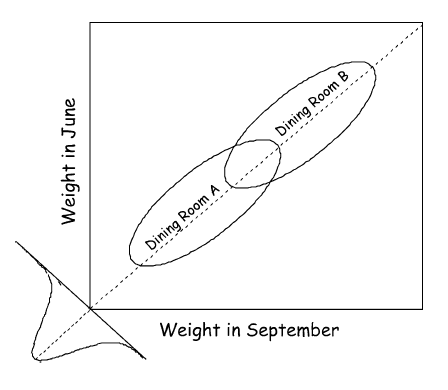
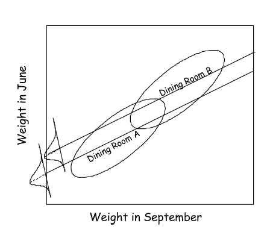

```{r setup, include=FALSE}
knitr::opts_chunk$set(message=F, cache=FALSE, comment=NA, warning=F, echo=F)
```

Summary of Pearl 2014

# Lord's paradox
## Background

Two statisticians are interested in determining whether there are differences among males and females in weight gain over the course of semester.  In the original depiction by Lord, there is an implication of some diet treatment, but all that can be assumed is that those under consideration both received the 'treatment' if there was one.  The two statisticians take different approaches to examining the data, yet come to different conclusions.

### Variables
- sex
- weight time 1
- weight time 2
- weight change

### Issues
The following graph is from Pearl 2014. The ellipses represent the scatter plots for boys and girls.  The diagonal 45^o^ degree line would represent no change from time 1 to time 2.  The center of the ellipses are both on this line, and thus the mean change for boys and girls are identical and zero.  The density plot in the lower left depicts the distribution of change scores centered on this zero estimate.


## Results

Statistician 1 focuses on change scores, while statistician 2 uses an ANCOVA to examine sex differences at time 2 while adjusting for initial weight.

- t-test for group difference on change score vs. ANCOVA approach
- Statistician 1 concludes no difference in *change*
- Statistician 2 concludes a difference in time 2 if controlling for time 1

### DAG

The model can be depicted as a directed acyclic graph as follows.


```{r}
library(DiagrammeR)
grViz("
digraph dag1 {

  # a 'graph' statement
  graph [fontsize = 10, layout=circo] #rankdir ignored for circo

  # several 'node' statements
  Change[shape = doublecircle, fontname = Helvetica, fontcolor='gray50', fillcolor='gray95', width=.5, penwidth=0.2];
  node [shape = box, fontname = Helvetica, fontcolor='gray50', style=filled, penwidth=0]
  Sex[color=lightsalmon]; 
  T1[color=navajowhite]; 
  T2[color=navajowhite]; 


  # edge statements
  Sex -> T1[label='a' fontcolor='gray25'  color='dodgerblue'] 
  Sex->T2 [label='b' fontcolor='gray25'  color='darkred']
  T1->T2 [label='c' fontcolor='gray25'  color='dodgerblue']
  T1->Change [label='-1' color='gray75' fontcolor='gray25'  ]
  T2->Change [label='+1' color='gray75' fontcolor='gray25'  ]
}
")

```


In the above we can define the following effects of sex on weight:

- <span style="color:#1e90ff">**Indirect effect**</span>: is a*c
- <span style="color:#8b0000">**Direct effect**</span>: b
- <span style="color:#66023C">**Total effect**</span>: b + a*c - a

Gain is completely determined as the difference between final weight and initial weight. 

### Who is *correct*?

- Both statisticians are correct
- t-test on change = total effect
- ANCOVA = direct effect

In summary, the two statisticians are focused on different effects from the same model- one the total effect, the other the direct effect.

### Data Example

We can get an explicit sense of the results by means of a hands on example.  In the following we have simulated data that will reproduce the situation described thus far.  Parameters were chosen for visual effect.  One thing that's not been noted about the example is that it likely would not occur. The total effect by definition would be larger than the direct effect as there would be strong sex differences at initial weight, and a strong correlation between initial and final weight, all in a positive manner. The other issue unadressed is that the entire focus is on whether an effect exists hinges on p-values, and with large enough data and such simple models, anything would flag significant. Plus there are issues of variance, nonlinear relations etc.

```{r dataSetup, echo=T}
library(dplyr)
set.seed(1234)
N = 200
group  = rep(c(0, 1), e=N/2)
pre = .75*group + rnorm(N, sd=.25)
post = .4*pre + .5*group + rnorm(N, sd=.1)
change = post-pre
df = data.frame(id=factor(1:N), group=factor(group, labels=c('Female', 'Male')), pre, post, change)
dflong = tidyr::gather(df, key=time, value=score, pre:post) %>% arrange(id)
head(df)
head(dflong)
```


```{r}
library(ggplot2); library(plotly); library(dplyr)
 
# plot_ly(filter(dflong, group=='Female'), x=time, y=score, group=id, mode='line', showlegend=F, line=list(color='#ff5500')) %>% 
#   add_trace(data=filter(dflong, group=='Male'), x=time, y=score, group=id, showlegend=F, line=list(color='dodgerblue'))

coefm = coef(lm(post~pre, filter(df, group=='Male')))
coeff = coef(lm(post~pre, filter(df, group=='Female')))
g = ggplot(aes(x=pre, y=post), data=df) +
  geom_abline(intercept=0, slope=1, color='gray50', alpha=.5) +
  geom_point(aes(color=group), alpha=.5) +
  stat_ellipse(aes(color=group), level=.999) +
  # geom_smooth(aes(color=group), method='lm', se=F) +
  scale_color_manual(values=c('#ff5503', 'dodgerblue')) +
  geom_abline(intercept=coefm[1], slope=coefm[2], color='dodgerblue') +
  geom_abline(intercept=coeff[1], slope=coeff[2], color='#ff5503') +
  lazerhawk::theme_trueMinimal()
ggplotly(g)

```

In the following we'll use lavaan to estimate the full mediation model, then run separate regressions to demonstrate the t-test on change vs. the ANCOVA approach.  As noted above, the t-test on change score measures the total effect of sex on final weight, while the ANCOVA measures the direct effect. It is unnecessary to distinguish them as separate modeling approaches, as they are merely regressions with different target variables.

```{r echo=T}
mod = "
  pre ~ a*group
  post ~ b*group + c*pre
  # change ~ -1*pre + 1*post
 
  # total effect
  TE := (b + a*c) - a
  TE2 := (a*-1) + (a*c*1) + (b*1)  # using tracing rules
"

library(lavaan)
lpmod = sem(mod, data=df)

summary(lpmod)
summary(lm(change~group, df))  # t-test on change scores = total effect
summary(lm(post~group+pre, df)) # 'ancova' uncovers direct effect etc.
```

 
### Aside
We can model the change score while adjusting for initial weight (and we should generally). Note that the coefficient for initial weight `r round(coef(lm(change~group+pre, df))[3],2)` is equivalent to the ANCOVA coefficient (`r round(coef(lm(post~group+pre, df))[3],2)`) minus 1. One way to think about this is just as we have been, but focus on the initial weight score instead of the coefficient for sex.  The indirect effect on change through final weight is its coefficient * +1, but the total effect includes the indirect plus the direct effect (i.e. direct effect - 1).

The change score result duplicates the ANCOVA result for the group effect. In fact all coefficients for covariates would be identical in a model for final weight vs. weight gain, as long as the baseline value is controlled for.  They are the direct effects for a model with final weight times + 1.  We can also calculate the total effect of Sex on change using Wright's tracing rules, and that sums up all paths leading from Sex to Change. That is the TE2 in the lavaan output.

See for example, Laird 1983.

```{r}
summary(lm(change~group+pre, df))
```


## Treatment with confounding
### Background
Wainer & Brown 2007 took a different interpretation of the paradox. Here we can think of a similar situation, but instead of sex differences we now have a group difference regarding whether one dines in a particular room[^wb].

### Variables
- weight time 1
- weight time 2
- weight change
- room A vs. B


### Issues

Visually we can depict it as before but showing the difference. The choice of comic sans font in the graph is due to Wainer and Brown and should be held against them.




- Heavier kids more likely to sit at table B
- Two statisticians come the conclusions as before


### Results

The DAG makes clear the difference in the model compared to the previous scenario.

```{r}
grViz("
digraph dag1 {

  # a 'graph' statement
  graph [fontsize = 10, layout=circo] #rankdir ignored for circo

  # several 'node' statements
  Change[shape = doublecircle, fontname = Helvetica, fontcolor='gray50', fillcolor='gray95', width=.5, penwidth=0.2];
  node [shape = box, fontname = Helvetica, fontcolor='gray50', style=filled, penwidth=0]
  Group[color=lightsalmon]; 
  T1[color=navajowhite]; 
  T2[color=navajowhite]; 


  # edge statements
  T1 -> Group[label='a' fontcolor='gray25'  color='dodgerblue'] 
  Group->T2 [label='b' fontcolor='gray25'  color='darkred']
  T1->T2 [label='c' fontcolor='gray25'  color='dodgerblue']
  T1->Change [label='-1' color='gray85' fontcolor='gray25'  ]
  T2->Change [label='+1' color='gray85' fontcolor='gray25'  ]
}
")

```

- Weight time 1 is now a confounder
- Arrow *from* time 1 to 'treatment'
- Statistician 1 concludes no change
- Statistician 2 concludes a difference (seen next)




While Wainer and Brown again suggest that both statisticians are correct, Pearl disagrees. Statistician 1 is incorrect because they do not adjust for the confounder, which is necessary to determine causal effects.  

Note that both paradox scenarios presented assume no latent confounders. If present then both statisticians are potentially wrong in both cases. As depicted however, it was not the case that two legitimate methods gave two different answers to the same research question, as Lord concluded originally.


## Birth Weight Paradox

### Background
The problem discussed thus far extends beyond controlling for baseline scores to involving any covariate, where the focus on change scores isn't even possible[^lord].

Here we are concerned with the relationship of birth weight and infant mortality rate. In general, low birth weight is associated with higher likelihood of death.  The paradox arises from the fact that low birth weight children born to smoking mothers have a lower mortality rate.

### Variables
- birth weight
- smoking mom
- infant mortality
- other causes

### Issues
- No difference score
- Before, focus on clash between two seemingly legitimate methods of analysis
- Now using standard regression approach but results seem implausible


### Results

- low birth weight children have higher mortality rate (100 fold higher)
- children of smoking mothers notably more likely to have low birth weight
- low birth weight children born to smoking mothers have a lower mortality rate
- Conclusion: expectant mothers should start smoking?!


### Explanation

#### Collider bias (explain away effect)

The DAG for this situation is depicted as follows. Smoking does have an effect on birth weight and infant mortality, but so do a host of other variables, at least some of which are far more detrimental.

```{r}
grViz("
digraph dag1 {

  # a 'graph' statement
  graph [fontsize = 10, layout=circo] #rankdir ignored for circo

  # several 'node' statements
  node [shape = box, fontname = Helvetica, fontcolor='gray50', style=filled, penwidth=0]
  Other[color=navajowhite]; 
  BW[color=lightsalmon]; 
  Smoking[color=navajowhite]; 
  Death[color=navajowhite]; 


  # edge statements
  edge [color='gray50']
  Smoking->BW Other->BW 
  BW->Death Smoking->Death Other->Death
}
")
```

Pearl explains the result from two perspectives.

#### Perspective 1
What is the causal effect of birth weight on death?

- Birth weight is confounded by smoking and other causes
- Controlling just for smoking leaves other causes, resulting in bias
- In addition, controlling for smoking changes the probability of other causes (due to BW collider) for any stratum of BW
-- Example: for BW='low', if we compare smoking vs. non-smoking mothers, we are also comparing situations where other causes are rare vs. one where other causes are likely, thus leading to the paradoxical conclusion.

#### Perspective 2
Another perspective is from the point of Lord's paradox. Here we are concerned with the effect of smoking on mortality above and beyond its effect though birth weight (i.e. the mediation context of previous).  Unlike before (or at least what was assumed before), here we have other confounders.

In this case, adjusting for birthweight doesn't sever all paths though the mediator, and actually opens up a new path, and the effect is now spurious.

```{r}
grViz("
digraph dag1 {

  # a 'graph' statement
  graph [fontsize = 10, layout=circo] #rankdir ignored for circo

  # several 'node' statements
  node [shape = box, fontname = Helvetica, fontcolor='gray50', style=filled, penwidth=0]
  Other[color=navajowhite]; 
  Death[color=navajowhite]; 
  BW[color=lightsalmon]; 
  Smoking[color=navajowhite]; 


  # edge statements
  edge [color='gray50']
  Smoking->BW Other->BW 
  Other->Death
}
", height=200)
```

Essentially we end up in the same situation.  By conditioning on birthweight == 'low', it does not physically keep birthweight from changing. Comparison of smoking vs. non-smoking leads to a comparison of infants with no other causes vs. those with other causes.

# Simpson's paradox more generally

Pearl 2013 notes

## Description
Simpson's paradox refers to a general phenomenon of reversal of results from what is expected. Lord's paradox can be seen as a special case, and while we have gone through the details of that particular aspect, we can describe Simpson's paradox with a simple example.

Consider a treatment given to males and females with the following success rates:

```{r}
# vals = data.frame(Sex=c('Male','Female'), Control=c('234/270','55/80'), Treamtent=c('81/87','192/263'))
# vals2 = data.frame(Sex=c('Male','Female'), 
#                    Control=round(c(234/270,55/80),2), 
#                    Treamtent=round(c(81/87,192/263), 2))

vals =data.frame(Sex=c('Male','Female'), 
                 Control=c('23/27','5/8'), 
                 Treamtent=c('8/9','19/26'))
vals2 = data.frame(Sex=c('Male','Female'), 
                   Control=round(c(23/27,5/8),2), 
                   Treamtent=round(c(8/9,19/26), 2))
htmlTable::htmlTable(vals, rnames=F, 
                     css.table='margin-left:auto; margin-right:auto; border:none;')
```

<br>

```{r}
htmlTable::htmlTable(vals2, rnames=F, 
                     css.table='margin-left:auto; margin-right:auto; border:none;')
```

<br>

And what are the total results across male and females?

<br>

```{r}
vals = data.frame(Sex=c('All', ''),
                  Control=c('28/35','80%'), 
                  Treamtent=c('27/35','77%'))
htmlTable::htmlTable(vals, rnames=F, 
                     css.table='margin-left:auto; margin-right:auto; border:none;')
```

So we are back to our low birth weight issue.

Pearl notes three things are required for resolving such a paradox.

- The solution must explain why the results are seen to be surprising
- The solution must identify those cases where the paradox will arise
- The solution must provide a means for making a *correct* decision


# References

Laird, N. 1983. *Further Comparative Analyses of Pretest-Posttest Research Designs*. [link](http://www.tandfonline.com/doi/abs/10.1080/00031305.1983.10483133)

Pearl, J. 2014.  *Lord's Paradox Revisited -- (Oh Lord! Kumbaya!)*. [link](http://ftp.cs.ucla.edu/pub/stat_ser/r436.pdf)

Pearl, J. 2013. *Understanding Simpson's Paradox*. [link](http://ftp.cs.ucla.edu/pub/stat_ser/r414-reprint.pdf)

Senn, S. 2006. *Change from baseline and analysis of covariance revisited*. [link](http://onlinelibrary.wiley.com/doi/10.1002/sim.2682/pdf)


[^wb]: The reasoning behind not using sex was because it is not a manipulable variable. See Holland & Rubin (1986) "No causation without manipulation."

[^lord]: Lord himself acknowledged this in determining group differences on college freshman grade point average while adjusting for 'aptitude'.

